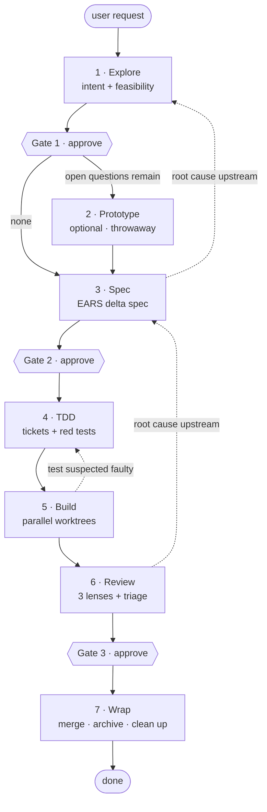
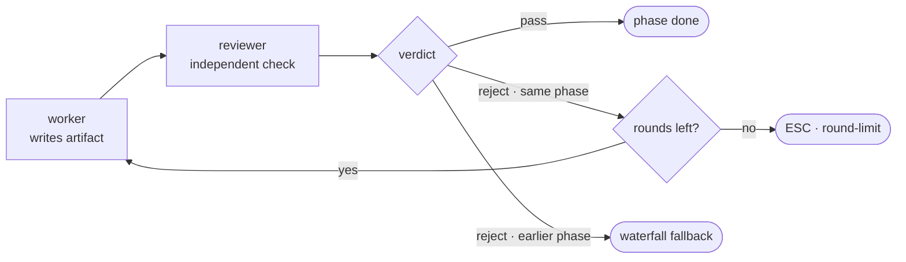

# agent-flow

A Claude Code plugin that runs spec-driven development and test-driven development
as a single waterfall workflow: seven phases, three approval gates, and a review
pass after every phase performed by someone other than the author.

繁體中文請見 [README.zh-TW.md](./README.zh-TW.md)。

## Install

```sh
claude plugin marketplace add wiasliaw/agent-flow
claude plugin install agent-flow@agent-flow
```

## Use it

```
/agent-flow:orchestrate add password reset to the auth service
```

That drives all seven phases in sequence and stops only at the three gates. Each
phase is also available on its own — `/agent-flow:explore`, `:prototype`, `:spec`,
`:tdd`, `:build`, `:review`, `:wrap` — which run their own quality loop but never
auto-continue to the next phase.

## The flow



Solid edges move forward. Dashed edges are waterfall fallbacks — the three shown
are examples, not the full set: any phase can fall back to any earlier phase, and
when several blocking findings point upstream the flow falls back to the earliest
of them.

| # | Phase | What happens | Gate | Artifact |
|---|---|---|---|---|
| 1 | **Explore** | Socratic dialogue pins down intent while the codebase and external options are investigated for feasibility | yes | `explore.md` |
| 2 | **Prototype** | Only runs when Explore left open technical questions. Throwaway experiments answer them; the code never reaches production paths | — | `prototype.md`, `prototype/` |
| 3 | **Spec** | An EARS delta spec stating what is ADDED, MODIFIED and REMOVED | yes | `spec-delta.md` |
| 4 | **TDD** | Cuts the spec into tickets, each carrying a real executable test that is run and confirmed failing | — | `tickets/<id>.md` |
| 5 | **Build** | Tickets run in dependency waves, each in its own git worktree, implemented until the tests go green | — | commits on the unit branch |
| 6 | **Review** | Three mutually invisible lenses — gap, edge-case, spec-compliance — then a triage pass that re-verifies every finding itself | yes | `review.md` |
| 7 | **Wrap** | Merges the delta into the main spec, archives the unit, removes worktrees and branches. No manual steps left over | — | `wrap.md` |

## The quality loop



Every finding carries a `targetPhase`, and that field alone decides the routing —
the author does not get to argue the point. Standard phases allow 3 rounds, Review
allows 5. The same target phase may be fallen back to 3 times before the flow gives
up and escalates.

The flow stops and asks you only in three situations: `round-limit` (a loop ran out
of rounds), `fallback-limit` (the same phase has been redone three times), and
`wrap-failure` (a wrap step did not verifiably succeed). Each one is recorded in
`decisions.md` and in `state.json` before you are asked.

Once the TDD loop passes, its tests become a contract: the Build implementer is
forbidden from editing them. A test that looks wrong is reported as a finding and
routed back to TDD instead.

## State externalization

A chat transcript is the worst place to keep the state of a long piece of work. It
gets compacted, it ends, and nothing in it can be reviewed in a pull request.
agent-flow keeps no durable fact there. Every decision, artifact and piece of
progress is written to a file under `.agent-flow/` and committed:

```
.agent-flow/
├── specs/<domain>/spec.md        # the living spec, updated only at Wrap
├── changes/<YYYY-MM-DD>-<slug>/  # the unit in progress
│   ├── state.json                # phases, gates, loops, tickets, fallbacks
│   ├── decisions.md              # every fallback and escalation, with its reason
│   ├── explore.md
│   ├── spec-delta.md
│   ├── tickets/<id>.md
│   ├── review.md
│   └── wrap.md
└── archive/<date>-<unit>/        # snapshot taken at Wrap
```

Three things follow, and they are the point rather than a side effect:

**Resumable.** `state.json` holds the current phase, which gates are approved and
how many rounds each loop has used, so a brand-new session a week later picks up
exactly where the last one stopped.

**Reviewable.** Intent, spec, tickets, findings and the reasoning behind every
fallback are diffable files on a branch, not transcript to scroll.

**Splittable.** Dispatches pass file paths rather than pasted contents, which is
what makes running many tickets in parallel affordable — and what lets an
independent reviewer re-verify an artifact it never watched being written.

Each unit gets its own `flow/<unit-name>` branch, one commit per ticket, never
squashed. `state.json` has exactly one writer — the main session driving the flow.

## License

MIT
