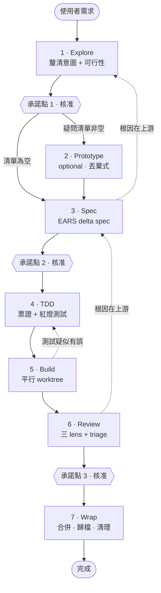
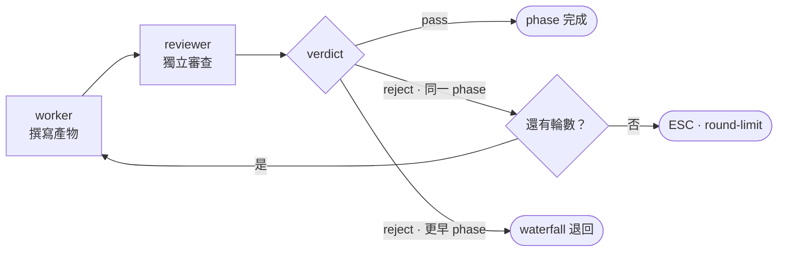

# agent-flow

一個 Claude Code plugin，把規格驅動開發（Spec-Driven Development, SDD）與測試驅動
開發（Test-Driven Development, TDD）合成單一條 waterfall 工作流程：七個 phase、
三個承諾點，每個 phase 結束都由作者以外的角色跑一次審查。

English: [README.md](./README.md)

## 安裝

```sh
claude plugin marketplace add wiasliaw/agent-flow
claude plugin install agent-flow@agent-flow
```

## 使用

```
/agent-flow:orchestrate 幫 auth service 加上密碼重設
```

這會依序驅動七個 phase，只在三個承諾點停下來等你。每個 phase 也可以單獨呼叫——
`/agent-flow:explore`、`:prototype`、`:spec`、`:tdd`、`:build`、`:review`、`:wrap`
——它們各自跑自己的品質迴圈，但做完不會自動接續到下一個 phase。

## 流程



實線是正常前進，虛線是 waterfall 退回。圖上畫的三條只是範例、不是完整集合：任何
phase 都可以退回任何更早的 phase；多個阻斷性 finding 同時指向上游時，退回其中
**最早**的那個。

| # | Phase | 做什麼 | 承諾點 | 產物 |
|---|---|---|---|---|
| 1 | **Explore** | 以蘇格拉底提問釐清意圖，同時內外並查、確認實作可行性 | 是 | `explore.md` |
| 2 | **Prototype** | 只在 Explore 留下未解技術疑問時才觸發。用丟棄式程式碼做實驗回答疑問，程式碼不進正式產品路徑 | — | `prototype.md`、`prototype/` |
| 3 | **Spec** | 寫 EARS delta spec，明列 ADDED／MODIFIED／REMOVED | 是 | `spec-delta.md` |
| 4 | **TDD** | 依規格切出票證，每張附一個真的可執行的測試，並實際跑過確認它是紅的 | — | `tickets/<id>.md` |
| 5 | **Build** | 票證依相依圖分波次平行執行，各自在獨立 worktree 裡實作到測試轉綠 | — | 單位分支上的 commit |
| 6 | **Review** | 三個互不可見的 lens——缺口、邊界案例、規格遵循——再由 triage 逐條親自重新查證 | 是 | `review.md` |
| 7 | **Wrap** | 把 delta 合併進主 spec、歸檔工作單位、移除 worktree 與分支。不留任何人工步驟 | — | `wrap.md` |

## 品質迴圈



每個 finding 都帶 `targetPhase`，路由**只由這個欄位決定**，作者沒有申辯空間。標準
phase 三輪上限，Review 五輪。同一個退回目標累計三次之後，流程不再重試而是上報。

只有三種情況流程會停下來問你：`round-limit`（迴圈用完輪數）、`fallback-limit`
（同一個 phase 已經重做三次）、`wrap-failure`（某個收尾動作無法驗證確實成功）。
每一種在問你之前都已經寫進 `decisions.md` 與 `state.json`。

TDD 迴圈一通過，那些測試就成為**合約**：Build 的實作者被禁止修改它們。覺得測試本身
有問題時，只能以 finding 回報並退回 TDD 處理。

## 狀態外部化

對話記錄是保存長期工作狀態最糟的地方——它會被壓縮、會結束，而且裡面沒有任何東西
進得了 pull request 供人審閱。agent-flow 不把任何需要留存的事實放在那裡。每一個
決策、產物與進度都寫成 `.agent-flow/` 底下的檔案並進版控：

```
.agent-flow/
├── specs/<domain>/spec.md        # 反映現況的主 spec，只在 Wrap 更新
├── changes/<YYYY-MM-DD>-<slug>/  # 進行中的工作單位
│   ├── state.json                # phase、gate、迴圈、票證、退回紀錄
│   ├── decisions.md              # 每一次退回與上報，連同原因
│   ├── explore.md
│   ├── spec-delta.md
│   ├── tickets/<id>.md
│   ├── review.md
│   └── wrap.md
└── archive/<date>-<unit>/        # Wrap 時建立的快照
```

由此推出三件事，而它們正是目的、不是副作用：

**可續做。** `state.json` 記錄目前在哪個 phase、哪些承諾點已核准、每個迴圈用掉
幾輪，一週後開一個全新 session 就能從當初停下的地方接著跑。

**可審閱。** 意圖、規格、票證、findings 與每次退回背後的理由，都是分支上可以 diff
的檔案，不是要用捲的對話記錄。

**可拆分。** 派工一律傳檔案路徑而非貼上內容，這是平行跑多張票證負擔得起的原因，
也是一個從沒看過產物如何生成的獨立審查者有辦法對它重新查證的原因。

每個工作單位有自己的 `flow/<unit-name>` 分支，一票一 commit，不 squash。
`state.json` 只有一個寫入者——驅動流程的主 session。

## License

MIT
